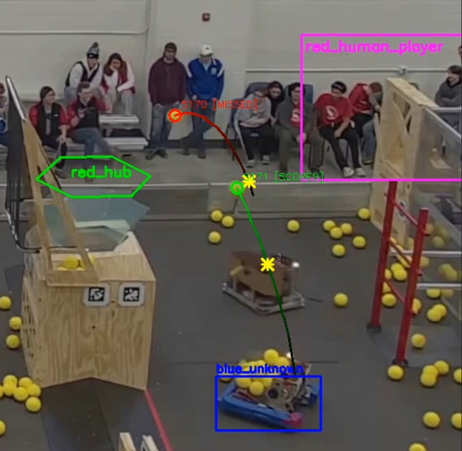

# FRC Ball Tracker

Real-time multi-ball tracking for FRC scouting. Detects shots, attributes them to robots, and determines scoring outcomes at 60+ fps.



## Features

- **YOLO-based detection** for robots (red/blue bumpers) and balls
- **Real-time processing** at 60+ fps with GPU acceleration
- **Shot attribution** - knows which robot made each shot
- **Three-tier classification** - shots, field passes, and ignored bounces
- **OC-SORT tracking** with Kalman filtering and ID recovery after occlusions
- **Hardware encoding** via NVENC for simultaneous display + recording
- **Live camera support** including RTSP streams

## Quick Start (Windows)

```batch
git clone https://github.com/63hz/scoutcam_pipeline.git
cd scoutcam_pipeline
install_frc_tracker.bat
python verify_install.py
```

Then run the real-time pipeline:
```batch
python 10_realtime_pipeline.py path\to\match.mkv --output annotated.mp4
```

## Pipeline Scripts

| Script | Purpose |
|--------|---------|
| `01_hsv_tuning.py` | Interactive ball detection tuning |
| `02_detection_test.py` | Validate detection across video |
| `03_tracking_sandbox.py` | Multi-ball tracking visualization |
| `04_zones_and_shots.py` | Define goals, robot zones, shot detection |
| `05_full_pipeline.py` | Two-pass batch processing with retroactive coloring |
| `06_robot_tuning.py` | Robot bumper HSV tuning |
| `07_yolo_poc.py` | YOLO robot detection testing |
| `08_train_bumper_model.py` | Train custom YOLO bumper model |
| `09_train_ball_model.py` | Train custom YOLO ball model |
| `10_realtime_pipeline.py` | **Real-time streaming pipeline** |

## Game Day Workflow

```
1. Record test clip at venue
2. Run 01_hsv_tuning.py → tune for lighting (press 's' to save)
3. Run 04_zones_and_shots.py → define goal regions (press 'g')
4. Run 10_realtime_pipeline.py on match recordings
5. Review annotated video + shot CSV
```

## Architecture

```
frc_tracker_config.json     # Single source of truth for all parameters
         ↓
frc_tracker_utils.py        # Core library (detectors, trackers, video I/O)
         ↓
stream_pipeline.py          # 5-stage threading pipeline for real-time
         ↓
10_realtime_pipeline.py     # Main entry point (60+ fps)
```

**Detection options:**
- HSV color detection (CPU, requires per-venue tuning)
- YOLO neural network (GPU, trained models included)

**Tracking:**
- OC-SORT with Kalman filter and Hungarian algorithm
- Handles occlusions and ID recovery
- Separate trackers for balls and robots

## Output

- **Annotated video** with trails, robot boxes, shot markers
- **CSV log** with shot events: frame, position, robot attribution, outcome
- **Real-time HUD** showing score breakdown by robot/alliance

## Requirements

- Python 3.9+
- NVIDIA GPU with updated drivers
- FFmpeg (for NVENC encoding)
- ~3.5 GB disk space

**Core packages:**
```
numpy, opencv-python, scipy, ultralytics, torch (CUDA)
```

See `requirements.txt` or run `install_frc_tracker.bat` for full setup.

## Controls

Most scripts support these keys:
- `SPACE` - Pause/resume
- `D` - Toggle debug view
- `S` - Save config
- `H` - Show help
- `Q` / `ESC` - Quit

## Configuration

All parameters live in `frc_tracker_config.json`. Key sections:

| Section | Purpose |
|---------|---------|
| `hsv_yellow` | Ball color detection range |
| `contour_filter` | Size/shape filtering |
| `tracking` | Ball tracker settings |
| `robot_tracking` | OC-SORT parameters |
| `shot_detection` | Velocity thresholds, classification |
| `goal_regions` | Polygon zones for scoring |
| `yolo_robot_detection` | YOLO model settings |

## License

MIT

## Acknowledgments

Built for FRC scouting teams to identify high-performing robots during alliance selection.
